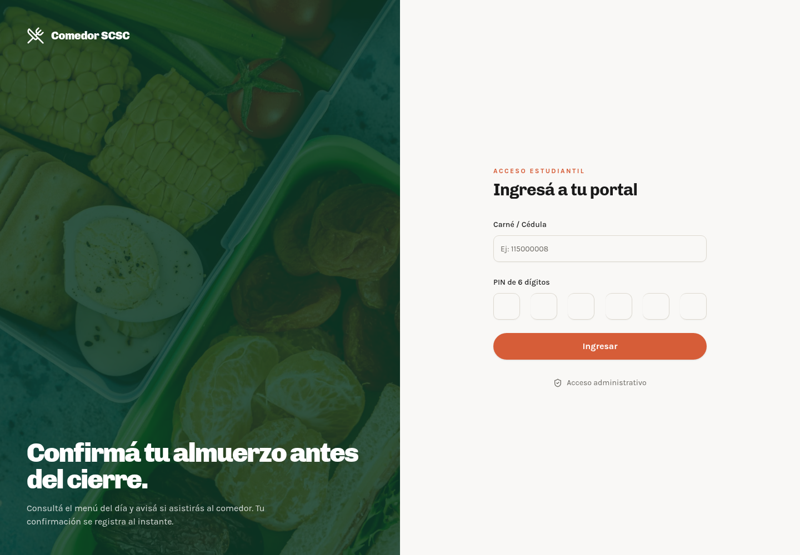
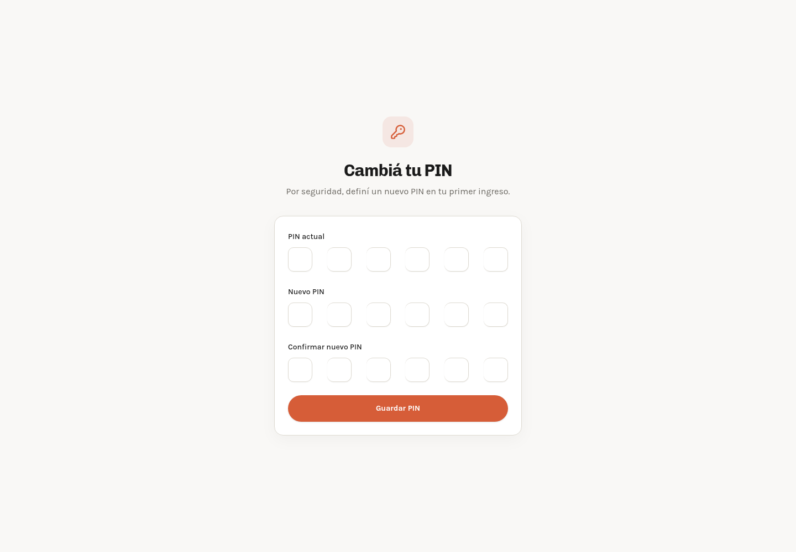
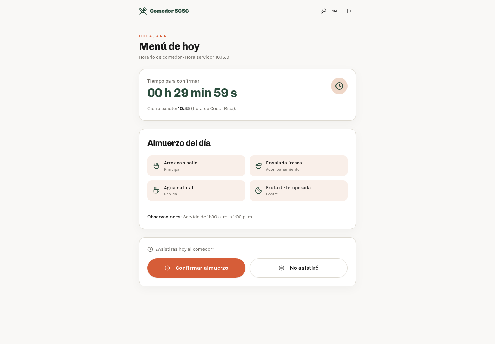

# Manual del estudiante: ingreso, cambio de PIN y registro de almuerzo

## ¿Para qué sirve este portal?

El portal permite consultar el menú del día y comunicar si asistirás al comedor. La confirmación debe hacerse dentro del horario habilitado para tu grupo y antes de la hora de cierre.

> Las capturas son ilustrativas. El menú, el nombre del estudiante y los horarios pueden variar según el día y el grupo.

## Antes de comenzar

Tené a mano:

- Tu carné o número de cédula.
- El PIN temporal o PIN actual de **6 dígitos**.
- Un teléfono, tableta o computadora con acceso al portal.

No compartás tu PIN con otras personas.

## 1. Ingresar al sistema

1. Abrí el enlace del **Portal del Comedor SCSC** que te proporcionó la institución.
2. En **Carné / Cédula**, escribí tu número de estudiante o cédula.
3. En **PIN de 6 dígitos**, ingresá tu PIN.
4. Presioná **Ingresar**.

Si los datos son correctos, se abrirá tu portal de estudiante. Si es tu primer ingreso o tu PIN fue reiniciado, el sistema te enviará automáticamente a la pantalla **Cambiá tu PIN**.

*En esta pantalla se solicita el carné o cédula y el PIN de seis dígitos.*

## 2. Cambiar el PIN

El cambio es obligatorio en el primer ingreso y también después de que el personal del comedor reinicie tu PIN.

1. En **PIN actual**, escribí el PIN temporal o el PIN que usás actualmente.
2. En **Nuevo PIN**, escribí un nuevo PIN numérico de 6 dígitos.
3. En **Confirmar nuevo PIN**, escribí nuevamente el mismo PIN.
4. Presioná **Guardar PIN**.
5. Cuando aparezca el mensaje **PIN actualizado correctamente**, entrarás al portal del estudiante.

Si aparece el mensaje **Los PIN nuevos no coinciden**, revisá que ambos PIN sean exactamente iguales. El PIN nuevo debe tener seis dígitos.

*Completá los tres campos y presioná **Guardar PIN**.*

## 3. Marcar que asistirás al almuerzo

1. En el portal, revisá el **menú del día**.
2. Verificá que el periodo de confirmación esté abierto y que todavía haya tiempo antes del cierre.
3. En la sección **¿Asistirás hoy al comedor?**, presioná **Confirmar almuerzo**.
4. Esperá el mensaje **¡Almuerzo confirmado!**.
5. Revisá la hora registrada. Esa es la hora oficial guardada por el sistema.

La confirmación se realiza únicamente para el día actual. El botón de confirmación queda deshabilitado después de registrar la asistencia para evitar duplicados.

*Revisá el menú, observá el tiempo restante y presioná **Confirmar almuerzo** para registrar tu asistencia.*

## Si finalmente no asistirás

Antes de la hora de cierre, podés retirar una confirmación presionando **No asistiré**. El sistema actualizará tu estado y ya no contará tu asistencia para ese día.

## Estados importantes

- **Aún no inicia el periodo de confirmación:** todavía no podés marcar; esperá la hora indicada.
- **Tiempo para confirmar:** el periodo está abierto. Confirmá antes de que termine el contador.
- **¡Almuerzo confirmado!:** tu asistencia quedó registrada.
- **Marcado: No asistiré:** informaste que no asistirás.
- **Registro de comedor cerrado:** ya pasó la hora límite y no se pueden realizar cambios.
- **No hay menú publicado para hoy:** consultá con el personal encargado del comedor.

## Recomendaciones de seguridad

- Mantené tu PIN en secreto y no lo anotés en un lugar visible.
- Cerrá la sesión si utilizás un equipo compartido.
- Confirmá que tu nombre y el menú correspondan al día actual antes de marcar.
- Si olvidaste el PIN o no podés ingresar, solicitá al personal autorizado que lo reinicie.

## Ayuda

Si el sistema rechaza tus datos, no aparece el menú o el periodo no se habilita cuando corresponde, informá al personal del comedor indicando tu nombre, sección y el mensaje que aparece en pantalla. Nunca enviés tu PIN por un medio público.
